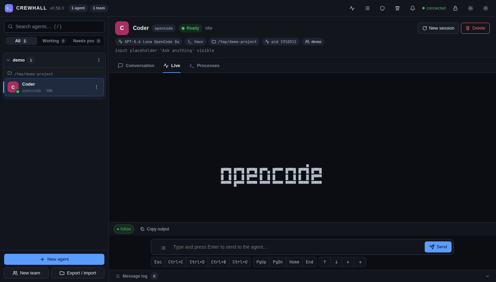
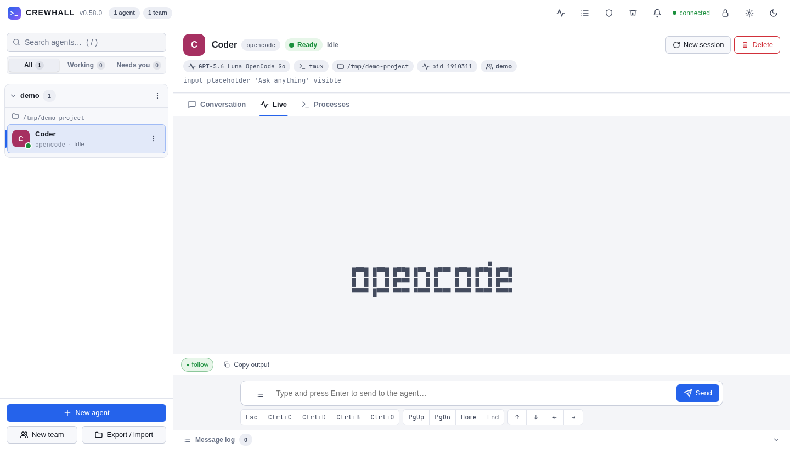
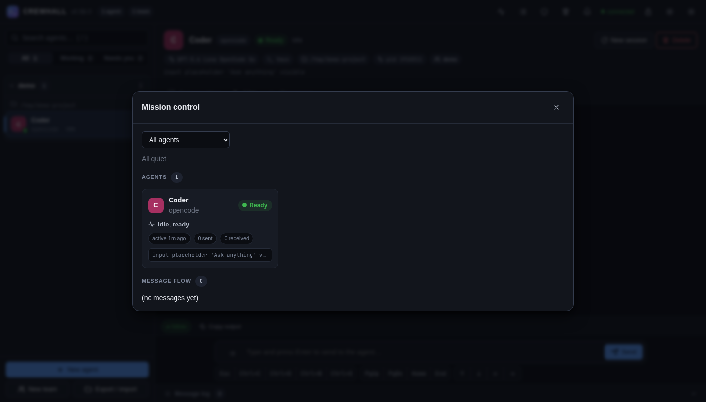

# crewhall

> **Instalar en otro equipo:** ver [INSTALL.md](INSTALL.md) (`scripts/release.sh` → release firmada;
> `scripts/deploy.sh`; `crewhall update`; `doctor`; `selftest`; `bundle export/import`). Política de versiones y
> actualizaciones: [RELEASING.md](RELEASING.md); historial: [CHANGELOG.md](CHANGELOG.md).


Capa experimental para **controlar sesiones interactivas reales y agentes CLI/TUI
desde un programa externo**, de forma independiente del mecanismo de transporte.

El mismo código de control funciona igual si la sesión se implementa con **tmux** o
con un **PTY** nativo (sin tmux). Sobre esa base, la **capa Harness** añade semántica
de agente (enviar un prompt, conocer el estado, esperar a que trabaje) sin que
`InteractiveSession` sepa qué es OpenCode, Claude Code, Codex, etc.

```
UI (curses)              <- observa y controla; cliente del daemon
    │
Controller / public API  <- daemon residente (socket Unix)
    │
Teams                    <- agrupación lógica: identidad + nombre + agent_ids
    │
Messaging                <- A → B por identidad de agente; sin broker
    │
Agent Harness            <- contrato común; adapters concretos
    ├── OpenCodeHarness
    └── ClaudeCodeHarness
    │
InteractiveSession       <- identidad, estado, eventos, API estable
    │
Backend                  <- tmux | pty   (no conoce el tipo de agente)
    │
proceso real (bash, python, opencode, claude, …)
```

`Teams` es una agrupación lógica por encima de `Messaging`: referencia `agent_id`s
del `AgentRegistry`, no guarda `Harness`/sesión/pane y **no** orquesta. `Messaging`
solo conoce identidad de agente y `Harness.send()`, nunca OpenCode/Claude/tmux/PTY.
La `UI` es un **cliente del daemon** (el `Controller` residente) y no salta capas.

## Capturas

| Oscuro | Claro |
| --- | --- |
|  |  |



## 1. Problema

Queremos tener simultáneamente varias sesiones interactivas (Claude Code, OpenCode,
Codex, cualquier CLI) y que un programa externo pueda descubrirlas, crearlas,
escribirles texto, enviarles teclas, leer su salida, detectar cambios, conocer su
estado, redimensionarlas, interrumpirlas y cerrarlas — sin que ese programa tenga
que saber si por debajo hay `tmux`, un `PTY` u otro backend.

Además, para un *agente* concreto queremos operar semánticamente
(`send("analiza este archivo")`, `state()`, `is_waiting()`) sin codificar a mano
"escribir, pulsar ENTER, esperar N segundos, buscar strings".

## 2. Arquitectura

Capas y responsabilidades:

- **`InteractiveSession`** (`crewhall/session.py`): la abstracción de sesión.
  Dueña de identidad (`session_id`), estado de proceso
  (`starting/running/exited/terminated/error`), buffer de salida, eventos y API
  (`write`, `send_key`, `capture`, `read_until`, `resize`, `interrupt`, `wait`…).
- **`Backend`** (`crewhall/backend.py`): transporte intercambiable
  (`PtyBackend`, `TmuxBackend`). Detalles de arranque, escritura de bytes, teclas,
  captura, señales, resize, ciclo de vida.
- **`Harness`** (`crewhall/harness/`): capa semántica de agente. Conoce el
  comando del agente y cómo detectar sus estados observables. Solo usa la API
  pública de `InteractiveSession`; **no** habla con tmux/PTY ni abre procesos.
- **`Controller`** (`crewhall/controller.py`): registra sesiones y agentes,
  resuelve por nombre/id y los expone al daemon.
- **Daemon** (`crewhall/daemon.py`): controlador residente accesible por
  socket Unix (la CLI lo arranca solo). Imprescindible para que las sesiones PTY
  sobrevivan entre invocaciones.

La identidad pública es **`session_id`** (sesión) y **`agent_id`** (== `session_id`
del agente). El backend mantiene sus propios identificadores (`tmux_session`,
`pane_id`, `pid`) como *metadata*.

## 3. `InteractiveSession`

API (deliberadamente pequeña): `start`, `write(text)` (sin ENTER), `send_key`,
`send_enter`, `read`, `capture`, `read_until`, `resize`, `interrupt`, `terminate`,
`kill`, `poll`, `wait`, `status`, `pid`, `info`, `events`, `wait_for_idle`/`is_idle`,
`close`.

```python
from crewhall import InteractiveSession, SessionSpec, get_backend

session = InteractiveSession(get_backend("pty"), SessionSpec(command=["/bin/bash"]))
session.start()
session.write("echo hola")
session.send_enter()
print(session.read_until("hola", timeout=5))
session.close()
```

Cambiar `"pty"` por `"tmux"` es todo lo que cambia.

## 4. Backends

- `PtyBackend` — `pty.openpty()` + `subprocess.Popen` con el slave como
  stdin/stdout/stderr, `start_new_session=True` y `TIOCSCTTY`. Sin tmux.
- `TmuxBackend` — `tmux -L crewhall -f /dev/null` (servidor/socket aislados),
  `capture-pane`, `send-keys -l`, `remain-on-exit` + `pane_dead_status`.

`get_backend("auto")` elige tmux si está disponible; si no, PTY.

| Aspecto | PTY | tmux |
|---|---|---|
| Dependencia externa | ninguna | binario `tmux` |
| Persistencia / descubrimiento | no | sí (adoptable) |
| Salida | stream crudo ANSI | pantalla + scrollback |
| Exit code | exacto | exacto |
| `attach` interactivo | no | sí |

## 5. Agent Harness (Fases 2–3)

La interfaz `Harness` (`harness/base.py`) expone operaciones semánticas:

| Operación | Descripción |
|---|---|
| `start(timeout)` | espera a que el agente esté utilizable |
| `send(prompt)` | escribe el prompt y envía ENTER (separadas) |
| `capture()` / `capture_recent(n)` | salida completa / últimas n líneas |
| `state()` → `AgentState` | estado observable (ver abajo) |
| `evidence()` | por qué se concluyó ese estado |
| `is_waiting()` | `state in {READY, WAITING_INPUT}` |
| `wait_for_state(target, timeout)` | espera un estado concreto |
| `stop(force=False)` | cierre ordenado o forzado |
| `info()` → `AgentInfo` | modelo de datos para la futura UI |

`AgentState`: `STARTING, READY, WORKING, WAITING_INPUT, EXITED, ERROR, UNKNOWN`.
Se prefiere `UNKNOWN` antes que afirmar un estado sin evidencia.

### `OpenCodeHarness`

Primer adapter. Solo depende de `InteractiveSession`. Señales observables
(validadas contra opencode 1.18.31, TUI 120×40):

| Estado | Evidencia |
|---|---|
| `STARTING` | TUI aún no montada (sin footer `ctrl+p commands` / `Build · <model>`) |
| `READY` | montada + placeholder `Ask anything…` (antes del primer prompt) |
| `WORKING` | línea de estado casa `esc\s+interrupt` (p. ej. `■■■■⬝⬝⬝⬝  esc interrupt`) |
| `WAITING_INPUT` | montada, sin `esc interrupt`, y un ciclo de trabajo terminó: se observó `WORKING`, o apareció el footer de tokens/coste (`12.6K (1%) · $0.00`) que no estaba al enviar |
| `EXITED`/`ERROR` | estado y exit code del proceso de la sesión |
| `UNKNOWN` | prompt enviado pero sin evidencia de finalización |

Documentación de cada señal en el docstring de `harness/opencode.py`.

### `ClaudeCodeHarness`

Segundo adapter (Claude Code 2.1.284, TUI 120×42). Solo depende de
`InteractiveSession`; no modificó `InteractiveSession` ni los backends.

| Estado | Evidencia |
|---|---|
| `STARTING` | header `Claude Code v…` + footer `⏵⏵ auto mode on (shift+tab to cycle)` aún no presentes |
| `READY` | montada, sin prompt enviado, input `❯` disponible |
| `WORKING` | footer con `esc to interrupt` |
| `WAITING_INPUT` | montada, sin `esc to interrupt`, y ciclo terminado: se observó `WORKING`, o apareció la línea `✻ … · done 4:04 PM` que no estaba al enviar |
| `EXITED`/`ERROR` | estado y exit code del proceso de la sesión |
| `UNKNOWN` | prompt enviado pero sin evidencia de finalización |

Particularidades reales del agente (aisladas en el adapter, **sin tocar el
contrato**):

- **Diálogo de confianza de workspace**: en carpetas no confiables Claude Code
  muestra un diálogo distinto. El harness **no** lo acepta automáticamente (eso
  modificaría la config del usuario); reporta `STARTING`/`UNKNOWN` hasta que el
  usuario confía en la carpeta.
- **Asentado de arranque**: el primer ENTER se pierde si se envía nada más montar
  la TUI; `ClaudeCodeHarness` espera a que la pantalla quede estable (quietud
  observable) y verifica el envío (la línea de input se vacía), reintentando ENTER
  una vez si hizo falta. Nada de `sleep` ciego.

### Qué demostró ser universal

Tras dos agentes distintos, el contrato común (`send` = `write` + `send_enter`,
`capture`, `state`, `wait_for_state`, `is_waiting`, `stop`, `info`, `AgentState`)
**no necesitó cambios**. Lo único específico de cada agente es:

- `_detect(text)` — las señales de su TUI;
- a lo sumo, un override de `send` para snapshot de finalización / asentado.

`InteractiveSession` y los dos backends **no** ganaron conocimiento de agentes.

#### `terminal idle ≠ agente terminó ≠ esperando input`

`InteractiveSession.wait_for_idle()` mide **quietud del terminal** (no llega salida
en `quiet_ms`). Eso **no** implica que el agente terminó, ni que esté esperando
input. El Harness usa señales propias del agente (`esc interrupt`, footer de
coste). Por eso `is_waiting()` no se apoya solo en la quietud.

## 6. Messaging (Fase 4)

Comunicación agente→agente mínima, **sin broker, sin Inbox, sin colas**. La capa
distingue *Messaging* (direccionamiento + identidad + entrega + trazabilidad) de
*Orchestration* (decidir qué hace cada agente), y solo implementa lo primero.

### Modelo `Message`

| Campo | Descripción |
|---|---|
| `message_id` | `msg_<hex>` único |
| `sender` / `recipient` | **agent_id** (identidad pública del AgentRegistry) |
| `body` | texto |
| `timestamp` | cuándo se emitió |

`Delivery` envuelve el intento: `{message, delivered, delivered_at, error,
sender_name, recipient_name}`. Los nombres son metadata de observabilidad para UI
y CLI; el `Message` se refiere solo a agentes (nunca a tmux/pid/sesión).

### API

```python
from crewhall import Controller

controller = Controller()
controller.send_message("agent-a", "agent-b", "hola")   # -> Delivery
controller.message_history(agent="agent-a", limit=10)   # -> list[dict]
```

O directamente `controller.messaging.send(...)` / `.history(...)`. El caller usa
**identidad de agente**, nunca sesiones ni backends.

### Semántica exacta de delivery

`delivered=True` significa únicamente:

> el `Harness.send()` del receptor aceptó el body y lo inyectó en su input
> (`InteractiveSession.write()` + `send_enter()`).

**No** significa que el agente terminó de procesarlo, ni que el modelo respondió,
ni que el mensaje tuvo efecto. Esas garantías más fuertes pertenecen a una capa
posterior (Inbox/Teams), no aquí. `send()` es síncrono: si el receptor no está
disponible dentro del `timeout`, lanza `HarnessError` y el `Delivery` queda con
`delivered=False` y `error`.

### Decisión sobre Inbox

Se descartó añadir `Agent → Inbox → Harness` en esta fase. Comparado con
`Messaging → Harness.send()`:

- **Simplicidad**: sin estado de cola, sin semántica de "pull".
- **Trazabilidad**: `Messaging.history` ya guarda emisión y entrega.
- **Concurrencia**: un lock por receptor serializa los envíos al mismo agente.
- **Futuro Teams**: un Inbox podrá envolver el mismo `Message`/`Delivery` sin
  cambiar el modelo; no cerrarlo ahora no cierra la puerta.

### Trazabilidad / eventos

No hay event bus nuevo. `Messaging` reutiliza el log de eventos de cada
`InteractiveSession` (el mismo que usa `session.events()`):

- emisor: `message_sent`
- receptor: `message_delivered` / `message_failed`

Así se reconstruye `ts A → B message_sent` y `ts B message_delivered` sin
infraestructura paralela.

### Aislamiento

`Messaging` resuelve `sender` y `recipient` contra el `AgentRegistry` (por nombre,
id o prefijo único), rechaza mensajes a uno mismo y solo llama a
`recipient_harness.send(body)`. No conoce OpenCode/Claude ni el backend.

## 7. Teams (Fases 5–6)

### Qué es un Team

```
Team = team_id + name + {agent_id, …} + created_at
```

Una **agrupación lógica dinámica** de agentes ya existentes. Referencia agentes por
identidad (`agent_id` del `AgentRegistry`); **no** guarda `Harness`, `InteractiveSession`,
`tmux_session`, `pane_id` ni `pid`.

### Qué NO es un Team

No es un líder, rol, supervisor, coordinator, planner, workflow, scheduler, task
manager ni canal. No decide qué hace cada agente. No tiene `status`, `prompt`,
`channel`, `queue` ni permisos. Es agrupación, no orquestación.

### Identidad y membership

- Identidad pública: **`team_id`** (`team_<hex>`). `name` es una etiqueta legible,
  no identidad. Dos Teams pueden compartir nombre; `get_team(name)` sería ambiguo,
  por eso se resuelve por `team_id` (o prefijo único).
- **Un agente puede pertenecer a varios Teams** (membership declarada en el Team,
  sin back-reference en el agente). Esto mantiene el `AgentRegistry` sin acoplarse a
  Teams y no limita la UI futura.
- Validación: todos los `agent_id` deben existir (por nombre o id), no se permiten
  duplicados y cada operación es **atómica** (si algo falla, no cambia nada). Los
  nombres se resuelven a su `agent_id` canónico.

### Membership dinámica (Fase 6)

- `add_member(team, agent)`: resuelve la identidad, rechaza agente inexistente y
  duplicado; cambia solo ese Team.
- `remove_member(team, agent)`: rechaza no-miembro de forma clara; **no** detiene ni
  elimina al agente; cambia solo ese Team.
- Ambas son **atómicas** y están protegidas por el lock del `TeamRegistry` (un
  `add_member`/`remove_member` concurrente no corrompe el conjunto).
- **Team vacío permitido**: si se quita el último miembro, el Team queda `members=[]`
  (no se auto-elimina). Con membership dinámica, vacío es un estado transitorio
  legítimo; prohibirlo introduciría un caso especial de ciclo de vida. También se
  puede **crear** un Team vacío y poblarlo después con `add_member`.
- `remove_member` acepta también el `agent_id` literal de un miembro ya desaparecido
  (para poder limpiar referencias `missing`).

### Relación con `AgentRegistry`

`Team` guarda **referencias**, no snapshots. `team_members(team)` resuelve en vivo
los `AgentInfo` actuales vía `AgentRegistry` en cada consulta. No se duplica
`AgentInfo` dentro del Team.

### Eliminación de agentes

Si `remove_agent(A)` y `A` pertenece a un Team:

- el Team **no** se modifica ni se elimina;
- `members()` resuelve solo los agentes vivos;
- `missing` expone los `agent_id` que ya no existen.

Elegido frente a "borrar el miembro" (acoplaría el `AgentRegistry` hacia los Teams)
y frente a "prohibir borrar" (introduce lifecycle complejo). El Team conserva la
referencia y la resolución es honesta sobre lo que falta.

Los `agent_id` **no se reutilizan**: un agente nuevo recibe un `agent_id` nuevo. Por
eso no se puede "volver a añadir" el `agent_id` de un agente eliminado (el `add_member`
fallaría con "unknown agent"); se añade el `agent_id` del nuevo agente. Un miembro
`missing` sí puede quitarse por su `agent_id` literal.

### Lifecycle

`create_team(name, agent_ids)` · `get_team(target)` · `list_teams()` ·
`add_member(team, agent)` · `remove_member(team, agent)` · `remove_team(target)` ·
`team_members(target)` · `team_info(target)`.
**`remove_team` NO detiene ni elimina agentes**: solo borra la agrupación.

### Teams y Messaging

No hay `team.send()` ni `broadcast()` todavía: no existe una necesidad demostrada.
El Team se usa para **consultar miembros** (`AgentInfo` en vivo) y el envío sigue
siendo `Messaging.send(sender, recipient, body)` entre identidades concretas. Un
Team no altera el `Harness` de sus miembros.

### ¿Existe "Team Message"?

**No.** Un `Message` tiene `sender`/`recipient` (agentes), no Team. Se *podría*
derivar "mensajes entre miembros de un Team" filtrando el historial por membership,
pero no hay un concepto de primer nivel "mensaje del Team" que resolver, y añadirlo
obligaría a decidir semánticas (¿intra-team? ¿cualquier extremo?) que aún no se
necesitan. Se deja fuera deliberadamente.

### CLI

```bash
crewhall agent team create research oc1 cc oc2
crewhall agent team info research
crewhall agent team remove-member research cc   # cc sigue corriendo
crewhall agent team add-member research cc      # sin recrear el agente
crewhall agent team list
crewhall agent team remove research             # los agentes siguen corriendo
```

## 8. UI interactiva profesional (Fases 7–7B)

Aplicación TUI de terminal con **`curses` de la stdlib** (cero dependencias nuevas).
Es un **cliente del daemon**: usa la misma `Controller` pública vía socket, así que la
UI y el CLI comparten estado y los agentes sobreviven a la UI.

### Arquitectura interna

```
ui/
  control.py   ControlPort + DaemonControl + LocalControl   (operaciones)
  model.py     AppModel (estado visual, modales, navegación)  (lógica, headless)
  view.py      render(model,w,h) -> [(texto, estilo)]         (presentación)
  app.py       bucle curses, teclas, color, resize            (I/O terminal)
```

`ControlPort` es la **única** superficie que la UI usa; la UI nunca importa
tmux/PTY/Harness/`InteractiveSession` ni marcadores. Los tipos de agente y backends
se descubren en runtime con `meta()` (`available_harnesses()` + `available()`), no se
hardcodean en el renderer.

### Layout (jerarquía visual)

```
  CREWHALL                                                  3 agents · 2 teams
────────────────────────────────────────────────────────────────────────────
WORKSPACE                        │auditor   [claude]
TEAMS                            │claude · tmux · WAITING
▌▾ fiscal (2)                    │INTERACTIVE · ^B to return to Navigator
   ◉ auditor               WAITING│──────────────────────────────────────────
   ● extractor             READY  │  ⏵⏵ auto mode on (shift+tab to cycle)
 ▾ desarrollo (0)                │  ┌──────────────────────────────────────┐
UNGROUPED                        │  │ ❯ Analiza las facturas pendientes     │
 ● opencode-3              READY  │  └──────────────────────────────────────┘
 ready                           │
 auditor · WAITING               ^B Navigator   Agent input active
```

Navegador (izquierda): **WORKSPACE** con **TEAMS** (contenedores plegables con sus
miembros) y **UNGROUPED** (agentes sin Team). Si no hay Teams, se muestra directamente
**AGENTS** (sin sección Teams vacía). A la derecha = **session header** + **transcript**.
Abajo: línea de estado y **footer contextual**. Barra lateral de ancho dinámico
(clamp 22–38, garantizando ≥40 para el panel derecho).

Estados con símbolo (legible en monocromo): `○ starting` · `● ready` · `◉ working` ·
`◉ waiting` · `? unknown` · `× exited` · `! error` (y la palabra del estado a la
derecha cuando el ancho lo permite; nunca solo color).

### Interactive Focus (passthrough al TUI real)

**No hay composer externo.** Seleccionar un Agent y pulsar **Enter** entra en
**Interactive Focus**: el teclado va **directamente al TUI real** del agente
(Claude Code / OpenCode) vía `InteractiveSession`:

```
crewhall (navigator) → Interactive Focus → TUI real del agente → InteractiveSession
```

- Se teclea directamente en el prompt del agente; **edición, Enter, Backspace,
  flechas, Tab, Esc, Ctrl+C/D, PgUp/PgDn y slash commands** los gestiona el agente.
- `Esc` se reenvía (es nativo: interrumpe/cancela). La salida de Interactive Focus es
  **`^B` (Ctrl+B)**, indicado en pantalla (`INTERACTIVE · ^B to return`).
- **Slash commands** (`/clear`, `/model`, `/help`, …) se transmiten **verbatim** +
  `Enter`; crewhall no los interpreta ni los registra.
- **Seguridad**: en Interactive Focus las teclas administrativas (`q`, `d`, `n`, `m`,
  `t`, `Ctrl+P`) **no** actúan; van al agente (o `q`/etc. se teclean). Las acciones de
  crewhall viven solo en el Navigator.
- **Viewport real**: el agente recibe el tamaño **exacto** del panel de sesión
  (`session_viewport`) mediante `InteractiveSession.resize` → PTY/tmux, y se
  **re-propaga en cada `KEY_RESIZE`**. El prompt nativo queda abajo de su área; el
  header/estado/footer no forman parte del viewport del agente.
- **Salida del agente**: si en Interactive Focus el agente pasa a `EXITED`/`ERROR`
  (p. ej. `/exit` en Claude, `Ctrl+D` en OpenCode), la UI **vuelve sola al Navigator**,
  conserva la selección y muestra `d Delete` (el agente **no** se borra solo).
- **Ctrl+C**: en Navigator sale de la app **limpiamente** (sin traceback); en
  Interactive Focus se **envía al agente** (que puede terminar → vuelve al Navigator).

### Teams: crear y administrar separados

- `t` → **solo el nombre** → `Enter` → Team vacío **válido** y seleccionado.
- `n` con un Team seleccionado → **New Agent in Team**: el agente creado se **añade
  automáticamente al Team**, queda **seleccionado** y entra en Interactive Focus.
- `a` (con Team seleccionado) → selector multi. Si **no hay agentes**, `Enter` ofrece
  **+ Create Agent** (crea y asocia al Team sin salir).
- `x` (con Team seleccionado) → selector **multi** de miembros actuales a quitar.
- `R` elimina el Team (**no** detiene agentes); `d` elimina un Agent (lo detiene).
- Un agente sin Team aparece en **UNGROUPED**; quitar su última membresía lo devuelve
  ahí sin detenerlo.

### Footer contextual

Las acciones mostradas dependen del contexto: navigator general, Agent seleccionado,
Team seleccionado, **Interactive Focus**, modal, selector múltiple y confirmación. En
Interactive Focus **no** se muestran atajos administrativos.

### Command palette (descubrimiento, no obligatoria)

`Ctrl+P` **solo en Navigator**; filtrado y **acciones conscientes del contexto**. Las
operaciones básicas **no** dependen de la palette.

### Crear agente

`n` abre un formulario: **Name**, **Agent type** (harnesses disponibles: `opencode`,
`claude`), **Backend** (`tmux` persistente/attachable · `pty` nativo/efímero) y
**Working directory**. `Enter` crea (validando nombre/duplicado/tipo/backend/cwd con el
error dentro del modal). Al crear, el agente queda **seleccionado y en Interactive
Focus**, listo para escribir directamente. Si `n` se abrió sobre un Team, además queda
asociado a ese Team.

### Output con follow mode

El transcript ocupa la mayor parte de la derecha. `PgUp`/`PgDn` y `Home`/`End`
desplazan; al desplazar hacia arriba se desactiva **follow** (tipo `tail -f`), y
`End`/llegar al fondo lo reactiva. Sin contenido, muestra un empty-state sutil
en lugar de rellenar el espacio.

### Robustez

- **Responsive**: a `80x24` se ve degradado a propósito; por debajo muestra
  `terminal too small · resize to at least 80x24`. `KEY_RESIZE` se maneja cada frame.
- **Daemon caído / reconexión**: `Client` re-asegura el daemon y reintenta dentro de
  la capa de conexión, así que un daemon caído se recupera de forma transparente
  (fresh start y socket stale también). Si el daemon es realmente inalcanzable,
  la UI muestra `DISCONNECTED · [r] Retry [q] Quit` sin crashear.
- **Errores**: toda operación produce `success`/`warning`/`error` en la barra de
  estado; nada tumba la UI. Operaciones lentas se ejecutan en hilo (estado "working…").

### Teclas

**Navigator Focus**

| Tecla | Acción |
|---|---|
| `↑`/`↓` (`k`/`j`) | mover selección |
| `Enter` | Team: expandir/colapsar · Agent: **Interactive Focus** |
| `PgUp`/`PgDn` · `Home`/`End` | scroll del transcript · follow |
| `n` | New Agent (o **New Agent in Team** si hay Team seleccionado) |
| `t` | New Team (solo nombre) |
| `a` / `x` | Add / Remove Members (selector múltiple) |
| `m` | Send Message (From = Agent seleccionado) |
| `d` / `R` | Delete Agent / Delete Team (confirmación) |
| `e` · `?` · `Ctrl+P` | Activity · Help · Command Palette |
| `q` / `Ctrl+C` | salir |

**Agent Interactive Focus** (el teclado pertenece al agente)

| Tecla | Acción |
|---|---|
| cualquier texto | va al prompt real del agente (edición nativa) |
| `Enter` · `Backspace` · `Delete` · `←/→/↑/↓` · `Home/End` · `Tab` · `PgUp/PgDn` | al agente |
| `Esc` | al agente (interrumpir/cancelar nativo) |
| `Ctrl+C` · `Ctrl+D` | al agente |
| slash commands (`/clear`, `/model`, …) | al agente, verbatim + `Enter` |
| **`^B`** (Ctrl+B) | volver a Navigator Focus |

En modales: `Tab`/`Shift+Tab` cambian de campo · `←/→/↑/↓` eligen opción · `Space`
marca (checklist) · `Enter` confirma · `Esc` cancela. En el selector múltiple:
`↑/↓` navega · `Space` marca · `Enter` aplica.

### Lanzar

```bash
cd ~/Projects/crewhall
python3 -m crewhall ui            # cliente del daemon (recomendado)
python3 -m crewhall ui --local    # embebe un Controller (sin daemon)
python3 -m crewhall ui --cwd DIR
# (o `crewhall ui` si haces `pip install -e .`)
```

## 8-bis. Terminales web

Además de los agentes, crewhall puede exponer **terminales** interactivas reales
(shells) en el Web UI y la CLI. Están **desactivadas por defecto** y se tratan como
capacidad privilegiada: una terminal es ejecución arbitraria de código como tu usuario.

- Aparecen **en el panel lateral como los agentes** (estado, host, `read-only`) y el
  panel principal es una **terminal real `xterm.js`**: se escribe directamente y las
  combinaciones de teclas funcionan (sin caja de input aparte). El panel **Terminals**
  las lista y gestiona, y cada una puede abrirse en su propia pestaña.
- Locales o por SSH, reutilizando el transporte fijo por `argv` de `ssh-tmux`; el
  stream remoto usa su propio `ControlPath` para no agotar `MaxSessions`.
- **Acceso con alcances.** El token maestro del Web UI **no** da acceso a terminales:
  la sesión del navegador debe *desbloquearse* con un **token de terminal**
  (`terminal:read`/`terminal:write`, limitado a hosts). El token se muestra **una vez**
  y solo se guarda `sha256`:

  ```bash
  crewhall web terminal-token new --scope write --host local --ttl 8h --label portatil
  crewhall web terminal-token list
  crewhall web terminal-token revoke <id>
  ```

  En el Web UI: **Ajustes → Access & network → Terminal tokens**; la pestaña Terminals
  ofrece crear uno si no hay ninguno. El desbloqueo se recuerda durante la sesión del
  navegador (se pide de nuevo tras reiniciar el daemon o al caducar la sesión).
- **Activar** con `terminals.enabled` (requiere `CONFIRM`): Ajustes → Terminals, o
  `crewhall settings set terminals.enabled true --confirm`. La CLI local
  (`crewhall terminal new|ls|send|key|capture|close|attach`) es de confianza: el socket
  UNIX ya es de tu usuario, así que no necesita token.
- Límites por token/host/total, timeout de inactividad que cierra al cliente (no a la
  terminal), tamaño máximo de mensaje y tope de clientes WebSocket.
- **Arrastrar y soltar** en el panel lateral: reordena equipos y mueve un agente a otro
  equipo.

## 9. Cómo ejecutar

Sin dependencias externas (solo stdlib de Python ≥ 3.10). Opcional: `pip install -e .`.

### CLI de sesiones (Fase 1)

```bash
crewhall list
crewhall create -b pty  -n worker  bash -i
crewhall send worker "echo hola"        # sin ENTER
crewhall sendline worker "echo hola"    # con ENTER
crewhall key worker ENTER
crewhall capture worker
crewhall read-until worker hola --timeout 5
crewhall resize worker 120 40
crewhall interrupt worker
crewhall attach worker                  # solo tmux
crewhall kill worker
crewhall daemon status|stop|logs
```

### CLI de agentes (Fases 2–3)

```bash
crewhall agent create -t opencode -n oc      -b tmux --wait
crewhall agent create -t claude   -n claude  -b tmux --wait
crewhall agent list
crewhall agent state claude
crewhall agent send claude "What is 17 times 3? Reply with just the number."
crewhall agent wait claude working --timeout 15
crewhall agent wait claude waiting_input --timeout 90
crewhall agent capture claude --recent --lines 20
crewhall agent stop claude
```

`-t/--kind` selecciona el harness (`opencode`, `claude`).

### CLI de mensajería (Fase 4)

```bash
crewhall agent message oc cc "MESSAGE_FROM_CLI_789"   # A → B por identidad
crewhall agent message cc oc "MESSAGE_FROM_CLI_987"   # B → A
crewhall agent messages                                # historial
crewhall agent messages --agent oc --json
```

## 10. Cómo probar

```bash
python -m unittest discover -s tests -t .
```

- `tests/test_contract.py`: contrato compartido PTY/tmux (`ContractMixin`) + guardas.
- `tests/test_cli.py`: CLI/daemon de sesiones end-to-end.
- `tests/test_harness.py`: contrato del Harness + `OpenCodeHarness` con sesión fake.
- `tests/test_harness_claude.py`: `ClaudeCodeHarness` con sesión fake + real opt-in.
- `tests/test_harness_compat.py`: el **mismo contrato** contra ambos harnesses.
- `tests/test_harness_mixed.py`: OpenCode + Claude reales coexistiendo (opt-in).
- `tests/test_controller_agents.py`: registro/resolución de agentes.
- `tests/test_messaging.py`: modelo `Message` + `Messaging` (fake), concurrencia.
- `tests/test_messaging_real.py`: OpenCode ↔ Claude real (opt-in).
- `tests/test_teams.py`: modelo `Team` + membership dinámica/validación/eliminación (fake).
- `tests/test_teams_real.py`: Teams reales con 2–3 agentes OpenCode/Claude (opt-in).
- `tests/test_ui.py`: `AppModel` (modales, formularios y validación, palette, selección,
  Teams, mensajería, output/follow, errores, render en varios tamaños).
- `tests/test_ui_real.py`: flujo completo de la UI con 3 agentes reales, creando por
  modal eligiendo tipo (opt-in).
- `tests/test_opencode.py` y `tests/test_harness_opencode.py`: integración real
  opt-in (`AT_RUN_OPENCODE=1`).

Integración real opt-in:

```bash
AT_RUN_OPENCODE=1 python -m unittest tests.test_opencode tests.test_harness_opencode
AT_RUN_CLAUDE=1   python -m unittest tests.test_harness_claude
AT_RUN_CLAUDE=1 AT_RUN_OPENCODE=1 python -m unittest tests.test_harness_mixed
AT_RUN_CLAUDE=1 AT_RUN_OPENCODE=1 python -m unittest tests.test_messaging_real
AT_RUN_CLAUDE=1 AT_RUN_OPENCODE=1 python -m unittest tests.test_teams_real
AT_RUN_CLAUDE=1 AT_RUN_OPENCODE=1 python -m unittest tests.test_ui_real
```

Experimentación manual:

```bash
python experiments/demo_bash.py
python experiments/demo_two_sessions.py
python experiments/demo_tui.py -b tmux                 # OpenCode crudo
python experiments/demo_harness.py -k opencode -b tmux # cualquier agente vía Harness
python experiments/demo_harness.py -k claude   -b tmux
python experiments/demo_two_agents.py -b tmux          # dos OpenCode
python experiments/demo_mixed_agents.py                # OpenCode + Claude
python experiments/demo_messaging.py                   # OpenCode <-> Claude (mensajes)
python experiments/demo_team.py                        # Teams dinámicos
python experiments/demo_ui.py                          # UI (AppModel) sobre el daemon
python experiments/demo_ui.py --local                  # UI sin daemon
```

## 11. Limitaciones actuales

- `capture()` no es un emulador de terminal: PTY devuelve stream crudo con ANSI;
  tmux devuelve texto renderizado. Un emulador (`pyte`) lo unificaría; **de momento
  no hace falta** (ver `ARCHITECTURE.md`).
- La detección de estado depende de marcadores de cada TUI (versión concreta);
  está aislada por adapter y devuelve `UNKNOWN` ante ambigüedad.
- Claude Code requiere que el **workspace esté confiado** (el harness no acepta el
  diálogo por ti: modificaría la config de Claude). Ejecuta en una carpeta
  confiada o confíala tú manualmente.
- Los prompts multilínea no se manejan de forma especial.
- `attach` interactivo solo en tmux.
- El daemon es de un host, sin autenticación (socket local `0600`).
- Los eventos son en memoria y acotados.
- Messaging es **síncrono** (bloquea hasta inyectar) y su historial es en memoria,
  acotado y no persistente. `delivered` no implica que el agente procesó el mensaje.
- No hay Inbox ni colas: si el receptor no está disponible en el `timeout`, falla.
  A → B y B → A simultáneos funcionan; envíos al mismo receptor se serializan.
- Teams es **en memoria, no persistente**; los miembros se resuelven en vivo y un
  agente eliminado se reporta en `missing` (no se limpia automáticamente).
- Solo hay **dos Harness con credenciales** en este entorno (OpenCode y Claude Code);
  Codex está instalado/autenticado pero exige confiar la carpeta (persistiría config),
  así que el "tercer agente" es una tercera instancia real, no un tercer Harness.
- No existe `team.send()`, `broadcast()` ni "Team Message".
- La UI es `curses` y **una sola instancia** consume el estado vía polling; no hay
  streaming incremental de output ni notificaciones push.
- No existe "detener agente sin eliminarlo": el `Controller` solo expone
  `remove_agent` (stop + unregister). La UI lo rotula como "eliminar (lo detiene)" y
  **no** inventó un lifecycle nuevo; el "stop-only" es una necesidad detectada, no
  implementada.
- No existe **agente de comando arbitrario**: `create_agent` requiere un `kind` de
  harness registrado (opencode/claude). La UI lista solo los harnesses disponibles y
  no inventó una API de "custom command"; es una necesidad detectada (harness genérico).
- El output de la UI muestra el capture existente sin normalizar ANSI; en PTY puede
  traer secuencias de escape. `capture` sigue siendo un **snapshot completo** (aunque
  el refresh es de ~0.8 s); capture incremental sería una mejora de capa inferior.
- El cuerpo del mensaje es de una línea (multilínea no soportado todavía).
- La UI no soporta mouse (keyboard-first).

## 12. Siguientes pasos

1. Tercer Harness (Codex u otro) si se dispone de credenciales/trust; el patrón está fijado.
2. Detección de estado más rica por adapter (p. ej. detectar diálogos de permiso).
3. Emulación de pantalla opcional (`pyte`) solo si aparece una necesidad real.
4. A partir del uso real de la UI, decidir con evidencia qué falta de verdad
   (p. ej. "stop-only", harness para comando arbitrario, capture incremental).
   Roles/orquestación siguen fuera.

## 13. Colaboración Team-bound (agent ↔ agent)

Cada Team es un espacio de colaboración. Los agentes se identifican, descubren a sus
compañeros y se envían mensajes, **restringido por Team**. El *control plane* (no la
TUI) impone la autoridad.

### Identidad

Al crear/iniciar un agente, `Controller` inyecta en su entorno:

```
CREWHALL_AGENT_ID, CREWHALL_AGENT_NAME, CREWHALL_TEAMS,
CREWHALL_TOKEN, CREWHALL_SOCKET
```

La identidad es **autoritativa del control plane**: el sender de un mensaje se deriva
del `CREWHALL_TOKEN` (validado por el daemon), no de un `--from` del agente.

### Discovery (bajo demanda, sin monitores)

```bash
crewhall agent identity          # YOU, TEAMS, TEAMMATES (solo tu Team)
crewhall agent list --team fiscal
```

### Mensajería agent → agent

```bash
crewhall message send --to extractor --message "Revisa las facturas de octubre."
```

- **Team boundary**: solo si `teams(sender) ∩ teams(recipient) ≠ ∅`. Si no comparten
  Team → `permission denied: recipient is not a member of a shared Team` (el mensaje
  **no** se entrega). Agentes sin Team no participan.
- Multi-Team: A en {fiscal,auditoría} puede hablar con B (fiscal) y con C (auditoría),
  pero B↔C no (no comparten Team).
- **Activación on-demand**: si el destinatario está STOPPED/EXITED, `send_message`
  reinicia **la misma entidad** (mismo `agent_id`, name, Teams, cwd, harness, backend)
  → espera READY → inyecta el mensaje. No hay monitor/heartbeat/polling: el propio
  `send_message` es el activador. Si no puede iniciarse → `Delivery.failed` con error.
- **Sin doble proceso**: lock por destinatario (envíos al mismo agente se serializan;
  activación única).
- Un mensaje entregado **no** implica que el agente lo procesó (semántica intacta).

La mensajería manual de la TUI (`m`) sigue funcionando (es una acción de operador, no
restringida por Team).

### Control files (CLAUDE.md)

Al crear/reiniciar un agente, crewhall asegura una **sección gestionada** en el
`CLAUDE.md` del directorio de trabajo (o lo crea si no existe), **sin tocar** el
contenido del usuario: solo añade/actualiza entre marcadores
`<!-- BEGIN/END AGENT-TERMINAL MANAGED SECTION -->`. Es **idempotente** (ejecutar N
veces no duplica) y **nunca** escribe fuera del `cwd` (ni en `~/.claude` ni en otros
proyectos).

## 14. Agent-terminal como entorno de comunicación (Fase 8)

El agente es **cliente** de crewhall desde su propia TUI: ejecuta el CLI con su
capacidad normal de shell, y no hay canal directo agente→agente.

```
AGENT → su TUI → ejecuta `crewhall ...` → control plane → Team auth
      → destinatario → inserción en la TUI del destinatario
```

- **Identidad**: el sender lo determina `CREWHALL_AGENT_ID`/`_TOKEN` del entorno
  del proceso; no hay `--from`.
- **Comandos operacionales** (también documentados en la sección gestionada de CLAUDE.md):
  `crewhall agent identity`, `crewhall agent list --team <team>`,
  `crewhall message send --to <agent> --message "..."`.
- **Interactive Focus**: `Ctrl+B`, `Esc`, `Ctrl+C`, `Ctrl+D`, flechas, Enter… se
  **envían al agente** (Ctrl+B es el prefijo de tmux y no debe consumirse). La salida
  de Interactive Focus es **`Ctrl+Alt+B`** (detectado por la secuencia `ESC`+`0x02`;
  configurable con `CREWHALL_EXIT_SEQUENCE` si el terminal no la distingue).
- Reutiliza la infraestructura Team-bound de la fase anterior (autorización, activación
  on-demand, control files).

## 19. Entrega fiable a agentes ocupados (Fase 12.3)

Una respuesta a un agente que está **WORKING** (p. ej. un orquestador bloqueado en su
turno esperando la respuesta) ya no se pierde:

- `Messaging.send` hace un intento síncrono breve (`wait`, por defecto 30 s).
- Si el receptor sigue ocupado y no es terminal, el mensaje se **difiere**: se marca
  `queued` y un worker en segundo plano lo entrega en cuanto el receptor pasa a
  `READY`/`WAITING_INPUT` (TTL acotado, por defecto 30 min). Es un reintento acotado,
  no una cola persistente.
- El CLI muestra `…` y "queued: recipient busy…", y devuelve éxito (exit 0).
- `Delivery.to_dict()` incluye `queued`.

Además, **`delete agent`** ahora desvincula al agente de todos los Teams
(`TeamRegistry.forget_agent`), por lo que ya no queda como `(missing)`. Y cada Team
ofrece **`+ agent`**: crea un agente con el Team preseleccionado, heredando su
workspace.

## 18. Web UI: transcript e input (Fase 12.2)

El Web UI dibuja **un único input** (el suyo). Para no duplicar el prompt del agente,
el panel de salida usa `Harness.transcript()` — el capture **sin la zona de input** de
cada agente (marcadores conocidos por adapter: Claude recorta su caja `❯` + footer;
OpenCode recorta el box `┃`/`╹▀▀`). El control plane expone `agent_transcript`; el
WebSocket lo usa para el panel de salida.

- El composer se **habilita/deshabilita según el estado**: activo en `READY`/
  `WAITING_INPUT`; deshabilitado en `WORKING`/`STARTING` (el agente rechaza input sin
  cola); en `EXITED`/`ERROR` indica que hay que reiniciarlo.
- El transcript devuelve el capture completo cuando el agente no tiene la caja de
  input en pantalla (p. ej. `WORKING`), para no cortar la salida por error.
- Gestión de Teams/agentes desde el Web UI: `+ member`, `- member`, `workspace`,
  `delete` por Team; `delete agent` en la cabecera del agente.
- La renderización fiel del TUI (colores/cursor) con un emulador (pyte) queda para una
  fase futura; hoy el transcript es texto (misma limitación de capture que la TUI).

### Herramientas del composer

Junto a *prompt templates* el composer añade:

- **Adjuntar archivos** (botón, *arrastrar y soltar* o pegar capturas). El archivo se
  sube a `POST /api/upload`, se guarda en el servidor y el agente recibe su **ruta
  absoluta** (imágenes incluidas: el agente las lee con sus herramientas). El nombre se
  sanea a un basename, se escribe `0600` con nombre único y hay tope de tamaño
  (`uploads.max_mb`). Destino: `uploads.mode` = `temp` (limpiado por el janitor) o
  `permanent` + `uploads.dir` (*Settings → Uploads*). Solo para agentes **locales**.
- **Selector de modelo**: Claude cambia con `/model <alias>` directo. OpenCode lee su
  catálogo real del servidor local del agente y **conduce su picker** (abre `/models`,
  escribe el nombre, `Enter`, y acepta el *variant* si aparece); Codex abre su propio
  *picker*. La lista se amplía con `providers.<kind>.models`. Los comandos se envían como
  *input sin turno* (`Harness.send_command`) para no marcar un turno falso.
- **Palette de slash-commands** por proveedor, **acciones rápidas** (interrumpir, nueva
  sesión, ciclo de permisos con `Shift+Tab`), **exportar** la conversación (Markdown/JSON),
  **búsqueda global** entre agentes y **menciones `@`** para rutas del workspace.

## 17. Acceso remoto seguro con Tailscale (Fase 12)

Tailscale aporta **transporte** (red privada); crewhall aporta **autenticación
y autorización**. Estar en la tailnet no implica estar autorizado.

### Token de acceso

```bash
crewhall web token generate     # escribe el token (una vez) y muestra el fingerprint
crewhall web token rotate       # rota (--rotate)
crewhall web token revoke
crewhall web status             # muestra fingerprint, perms y datos de Tailscale (NUNCA el token)
```

El token se guarda en `$XDG_CONFIG_HOME/crewhall/web-token` (modo `0600`), **fuera**
de `StateStore` y de `AgentInfo`. No se registra en logs ni se envía a los agentes.

### Modos

```bash
crewhall web                      # LOCAL, 127.0.0.1:8765, SIN auth (comportamiento por defecto)
crewhall web --require-auth       # local pero exigiendo token
crewhall web --tailscale          # bind a la IPv4 de Tailscale; auth OBLIGATORIA
crewhall web --tailscale --port 9000
```

En modo remoto (bind no-loopback) la autenticación es **obligatoria** y el arranque
falla si no existe token. `--tailscale` detecta la IPv4 con `tailscale status --json`
(sin hardcodear `100.x`), admite el DNS name y añade ambos al allow-list de `Host`.
Si Tailscale no está instalado/autenticado → error claro; el modo local sigue igual.

### Autenticación HTTP y WebSocket

- Navegador: `POST /login {token}` → cookie de sesión firmada (`HttpOnly;
  SameSite=Strict; Path=/`), sin secretos en `localStorage` ni en la URL.
- CLIs/scripts: `Authorization: Bearer <token>`.
- El **WebSocket** valida la misma autenticación en el handshake (401 si falta).
- **Origin/Host**: sólo se aceptan hosts loopback o los del allow-list; un `Origin`
  ajeno a la allow-list → 403. Bearer+fetch evita CSRF de cookies; `SameSite=Strict`
  protege la sesión.

### Servicio Web separado (opt-in)

```bash
crewhall service install-web [--web-tailscale]   # crewhall-web.service
crewhall service web-unit                        # solo imprime la unidad
crewhall service uninstall-web
```

Separado de `crewhall.service` (el motor). No expone a Internet.

### SSH tunnel (sigue funcionando)

```bash
ssh -L 8765:127.0.0.1:8765 usuario@servidor   # luego http://127.0.0.1:8765/
```

## 16. Web UI como cliente del motor (Fase 11)

Interfaz web **local** que es un cliente del mismo control plane que la TUI y la CLI.
No crea un segundo motor: traduce HTTP/WebSocket a las operaciones del daemon.

```
Browser ─▶ Web UI (HTTP/WS) ─▶ ControlPort/Client ─▶ daemon (control plane) ─▶ agentes
```

- **Cero dependencias nuevas**: servidor con `http.server` de la stdlib y WebSocket
  mínimo (RFC6455) en `crewhall/web/`.
- Lanzar:

```bash
crewhall web                     # http://127.0.0.1:8765 (host local por defecto)
crewhall web --host 127.0.0.1 --port 9000
```

- La página muestra **Teams** (con workspace), **agentes** (estado/harness/backend/cwd/pid),
  transcript con **follow/pausa**, **input** directo al agente (write + teclas: Enter,
  Esc, Ctrl+C, Ctrl+D, Ctrl+B, flechas), **mensajería** A→B y **creación de Team/Agent**
  (con la misma precedencia de cwd). El servidor empuja cambios por **WebSocket**
  (adaptación server-side; el navegador no hace polling).
- Solo se permiten operaciones del control plane (lista blanca); `shutdown` y demás no
  están expuestas. Host por defecto `127.0.0.1` (sin exposición pública).
- Cerrar el navegador **no** detiene daemon ni agentes; al reabrir, mismo estado.

### Contención de `TMPDIR` (Bun/OpenCode)

Bun (OpenCode) extrae ~14 MB de librería nativa en `TMPDIR` en cada arranque y no la
borra; en un `/tmp` tmpfs con cuota de usuario eso lo agota. crewhall aísla los
agentes en un `TMPDIR` **propio** (`$XDG_STATE_HOME/crewhall/tmp`, nunca `/tmp`
compartido) y lo **poda**: al arrancar el daemon, al parar/eliminar un agente y cada
15 min (janitor). Elimina ficheros más viejos de 1 h y capa el total a 512 MB. La
unidad systemd exporta `TMPDIR` a ese directorio. Un `TMPDIR` explícito del usuario
se respeta.

## 15. Team Workspace + motor independiente (Fase 10)

El **motor** (daemon = control plane) ya no depende de ninguna interfaz.
Las interfaces (TUI, CLI, futura Web UI) son **clientes** del mismo control plane
(resuelto por un socket determinista, no por el cwd).

### Team workspace

Un Team puede tener un **workspace** persistente (directorio absoluto existente):

```bash
crewhall agent team create fiscal --workspace ~/Projects/fiscal
crewhall agent team set-workspace fiscal ~/Projects/fiscal
crewhall agent team list --json      # incluye workspace
```

Precedencia de cwd al crear un agente:

```
agent.cwd explícito  >  team.workspace  >  cwd por defecto
```

```bash
crewhall agent create -t opencode -n auditor  --team fiscal   # hereda workspace
crewhall agent create -t claude   -n especial --team fiscal \
    --cwd ~/Projects/fiscal/scripts                                  # cwd propio
```

### Interfaces: local, Tailscale y TUI (en caliente)

El daemon aloja el Web UI y se controla con comandos, sin reiniciar servicios ni dejar terminales abiertas:

```bash
crewhall tailscale   # solo por tu tailnet (exige token)     crewhall local   # solo 127.0.0.1
crewhall off         # ninguna                                crewhall frontends   # estado
```

El modo se recuerda y se restaura al arrancar el daemon. La TUI es bajo demanda (`crewhall ui`).
Detalle y despliegue en un servidor por SSH: [INSTALL.md](INSTALL.md).

### Garantías sobre tus proyectos

- **`CLAUDE.md` / `AGENTS.md`**: crewhall solo **añade un bloque al final** (`O_APPEND`: los bytes
  originales no se reescriben), o refresca *ese* bloque en su sitio. Opera en bytes (no cambia codificación,
  BOM ni finales de línea; el bloque sigue el estilo LF/CRLF del archivo), sigue symlinks sin romperlos,
  escribe de forma atómica, serializa agentes concurrentes con un lock y **verifica** lo escrito
  (si algo no cuadra, restaura el original). Si los marcadores son ambiguos (citados en prosa,
  duplicados o sueltos) o el archivo es binario/enorme, **no lo toca**. Antes de modificar guarda una copia
  en `~/.local/state/crewhall/control-backups/`. Cada agente recibe el archivo que realmente lee
  (Claude → `CLAUDE.md`; OpenCode → `AGENTS.md`, o `CLAUDE.md` si solo existe ese). Se desactiva con
  `CREWHALL_CONTROL_FILES=off`.
- **Hooks**: los agentes Claude arrancan con `--settings <archivo propio en el state dir>`, que **suma**
  los hooks de crewhall a los de tu usuario y proyecto (no reemplaza ninguno; verificado con Claude
  real: disparan los del proyecto y los nuestros). No se escribe nada en `.claude/` ni en la configuración
  de OpenCode.

### Equipos declarativos y perfiles

```bash
crewhall agent team up team.toml      # crea equipo + agentes; idempotente
crewhall agent create -n rev --profile revisor
```

`team.toml` (o `.json`):

```toml
[team]
name = "frente1"
workspace = "~/Projects/x"

[[agent]]
name = "orquestador"
kind = "claude"
args = "--agent orq"

[[agent]]
name = "revisor"
profile = "revisor"      # defaults desde ~/.config/crewhall/profiles.toml
```

```toml
# ~/.config/crewhall/profiles.toml
[profile.revisor]
kind = "claude"
args = "--agent reviewer"
```

Las claves permitidas están acotadas (`name, kind, args, cwd, backend, profile`); lo demás
se rechaza. Los flags explícitos ganan sobre el perfil.

### Mensajería: remitente y estados

El texto inyectado llega como `[from: <emisor>] <texto>` (lo antepone crewhall).
Cada entrega tiene un estado: `queued` → `injected` (escrita en el terminal del receptor)
→ `acknowledged` (el receptor empezó a trabajar). Un mensaje idéntico pendiente en la
cola no se duplica.

### Conversación completa (Web UI)

La pestaña **Conversation** (vista por defecto y principal para agentes Claude y OpenCode; **Live** queda como vista secundaria) muestra
toda la conversación con estructura: markdown (encabezados, listas, bloques de código),
llamadas a herramientas y sus resultados colapsables, sin el input del TUI, con scroll
real dentro de un único contenedor (sin botones): al llegar arriba carga mensajes anteriores
automáticamente, sigue lo último si estás abajo y no te mueve si estás leyendo arriba. Un agente
sin mensajes también abre Conversation (estado vacío). Se envía con Enter. **Live** sigue
mostrando el TUI (diálogos, permisos) con sus teclas.

En Conversation la interacción es solo el input de texto (Enter envía) y **Ctrl+C**, que detiene
el turno en curso (solo actúa si el agente está trabajando: Claude recibe un ESC; OpenCode, dos).
No hay botones de navegación: el historial se recorre con el scroll del contenedor.

Al crear un agente (Claude u OpenCode) la UI entra directo a Conversation aunque esté vacía
("No messages yet"); al enviar el primer mensaje se muestra al instante (eco atenuado) y se
reemplaza por el historial real en cuanto existe. Un agente detenido conserva su conversación
(Claude: se persiste el id de sesión). Si OpenCode no entregó el evento de creación de sesión,
se descubre por la API (`/session`: la primera sesión del directorio creada tras el arranque
y no reclamada por otro agente).

- **Claude:** se lanza con `--session-id` y se lee `~/.claude/projects/**/<id>.jsonl`.
- **OpenCode:** se lanza con `--port <libre>` y `OPENCODE_SERVER_PASSWORD` (por archivo
  privado, no por argv); el servidor local de OpenCode (solo 127.0.0.1, con contraseña)
  entrega el historial (`/session/<id>/message`) y eventos exactos (`session.created`,
  `session.status`, `session.idle`) que reemplazan la heurística de pantalla.
- Se desactiva con `CREWHALL_CONVERSATIONS=0`. Si pasas `--session-id/--resume/-c`
  (Claude) o `--port` (OpenCode) en los argumentos, se respeta tu elección y no hay historial.

### Hooks de Claude (estado exacto) (Claude) y eventos (OpenCode)

Los agentes `claude` arrancan con `--settings` apuntando a hooks (`UserPromptSubmit`,
`Stop`) que avisan al daemon (`crewhall agent hook <evento>`, autenticado con el
token del agente). Así "turno terminado" es una señal exacta además de la heurística de
pantalla. Se desactiva con `CREWHALL_HOOKS=0`.

Argumentos extra para el comando del agente (p. ej. `claude --agent reviewer`):

```bash
crewhall agent create -t claude -n revisor --args="--agent reviewer"
```

Se agregan al comando base como argv (nunca pasan por un shell) y se conservan al
reiniciar/restaurar el agente. En la TUI y en el Web UI es el campo
*Command arguments*. Se parsean al estilo shell (`--flag "valor con espacios"`);
usa la forma `--args=...` en el CLI para que un guion inicial no se interprete
como opción.

El `CLAUDE.md`/`AGENTS.md` gestionado se crea en el **cwd real del agente**.

### Persistencia y servicio

- El estado **lógico** (Teams, workspace, definiciones de agentes) se persiste en
  `$XDG_STATE_HOME/crewhall/state.json` (sin tokens ni credenciales). Los
  procesos y su output **no** se persisten.
- Tras un reinicio del daemon, los agentes se reconstruyen como entidades lógicas
  **EXITED** (mismo `agent_id`); no se arrancan solos. Un `message send` o `start`
  los reactiva.
- Unidad **systemd de usuario** instalable (no modifica el sistema sin permiso):

```bash
crewhall service unit        # imprime la unidad
crewhall service install      # ~/.config/systemd/user/crewhall.service + enable --now
systemctl --user status crewhall
crewhall service uninstall
```

- Cerrar la TUI / terminal / SSH **no** detiene el daemon ni los agentes.

## Estado de esta fase (Fase 9.1 — Pulido de interacción y agent input)

- **Input limpio tras revive**: `Harness.send` ahora espera a que la línea de entrada
  del agente esté **limpia** (`ensure_input_clean`) antes de inyectar. Cada adapter
  expone `input_line()` (Claude: línea `❯` sin placeholder; OpenCode: rail `┃` sin el
  footer `Build ·`). Si hay residuo (`/model sonnet`) y el agente está idle, se limpia
  con `Ctrl+U`/`Esc` de forma acotada. Es **basado en evidencia**, no un sleep fijo.
  Verificado real: mensaje tras revive llega limpio 3/3.
- **Navegación en Interactive Focus**: `Ctrl+Alt+K` = agente siguiente, `Ctrl+Alt+J` =
  anterior (wrap-around), `Ctrl+Alt+B` = salir. Solo cambia la **vista** (transcript,
  viewport, resize, follow); **no** detiene, reinicia ni envía input a ningún agente.
- **Ctrl+B se reenvía al agente** (no lo captura crewhall; sigue siendo el prefix
  de tmux). `Esc`, `Ctrl+C`, `Ctrl+D`, flechas y Enter también van al agente.
  Secuencias configurables: `CREWHALL_EXIT_SEQUENCE`,
  `CREWHALL_PREV_SEQUENCE`, `CREWHALL_NEXT_SEQUENCE`.
- 227 tests: 213 OK + 14 skips; con reales **227/227 OK**. Checkpoint:
  `pre-interaction-polish`.

## Estado de la fase anterior (Fase 9 — Cooperación real entre agentes)

**COMPLETA.** Team `fiscal` {auditor(Claude/Opus), extractor(OpenCode), conciliador(Claude/Opus)}.
El usuario dio **solo una tarea de alto nivel** a auditor; extractor y conciliador partieron
`EXITED`. Evidencia (`~/.cache/at-backups/fase9-evidence.txt`):

- auditor, sin que nadie le nombrara `crewhall`: ejecutó `crewhall agent identity`,
  `crewhall agent list --team fiscal`, **decidió** el reparto y ejecutó
  `crewhall message send --to extractor --message "Hola, soy auditor (equipo fiscal)…"`.
- extractor y conciliador **se activaron** (on-demand) **conservando su `agent_id`**, y
  ejecutaron `crewhall agent identity` desde su propia TUI; conciliador respondió con
  `crewhall message send --to auditor --message …`.
- Los 3 `agent_id` se conservaron; auditor integró las aportaciones y continuó su análisis.

crewhall **no** interpretó tareas, no asignó roles, no mantuvo workflow ni estado de
tareas: solo proporcionó identidad, Team, autorización, transporte y activación.

Ajuste de entorno: `usable_tmpdir()` prefiere un tmpfs dedicado (`/dev/shm/crewhall-tmp`)
cuando `/tmp` está agotado por cuota; verificado que el sandbox de bash de los agentes ejecuta
comandos con él.

217 tests: 203 OK + 14 skips; con reales **217/217 OK**. Checkpoint:
`pre-real-agent-cooperation`.

## Estado de la fase anterior (Fase 8.1 — E2E agente real → crewhall → agente real)

**COMPLETA.** Evidencia real (transcripts guardados en `~/.cache/at-backups/fase81-*.txt`):

- **Claude desde su propia TUI**: dada solo una instrucción conceptual (sin nombrar
  `crewhall`), descubrió el mecanismo vía `CLAUDE.md` y ejecutó literalmente
  `crewhall message send --to extractor --message "Hola, soy auditor…"`. El
  operador **no** ejecutó el comando. Reactivó a OpenCode `EXITED` conservando el
  mismo `agent_id`.
- **OpenCode desde su propia TUI**: ejecutó `crewhall agent identity` (mostró
  `TEAMS: fiscal` y `recipient · claude · exited`), `crewhall agent list` y
  `crewhall message send --to recipient --message "…"`, reactivando a Claude
  `EXITED` con el mismo `agent_id`.
- **Fix arquitectónico descubierto por la prueba**: el CLI invocado por un agente
  ignoraba `CREWHALL_SOCKET` y podía arrancar un daemon distinto (sin los
  agentes/Teams). Ahora `Client` respeta el socket del control plane, y
  `runtime_dir()` es determinista (elección cacheada) para que clientes concurrentes
  usen el mismo socket.
- **Entorno**: el tmpfs `/tmp` estaba agotado por cuota de usuario (ajena al
  proyecto); se recuperó espacio de directorios `tmp*` stale no abiertos, permitiendo
  que el sandbox de bash de los agentes ejecutara comandos.
- 217 tests: 203 OK + 14 skips; con reales **217/217 OK**, sin daemons residuales.
- Checkpoint: `pre-crewhall-real-agent-e2e`.

## Estado de la fase anterior (Agent-terminal Agent Communication)

Demostrado y verificado:

- **Entrega agent→agent vía control plane** real: auditor(Claude) activa y entrega a
  extractor(OpenCode) parado (mismo `agent_id`); aislamiento por Team (auditor↛abogado);
  respuesta inversa.
- **Ctrl+B se transmite al agente**; salida de Interactive Focus = `Ctrl+Alt+B`
  (secuencia `ESC`+`0x02`, configurable); `Esc`/`Ctrl+C/D`/flechas al agente.
- **CLAUDE.md** recibe una sección gestionada operacional (comandos y reglas),
  preservando el contenido del usuario e idempotente.
- **Robustez de entorno**: `TMPDIR`/runtime con fallback al home cuando el tmpfs por
  defecto está agotado (por cuota), propagado a los agentes vía `env` en tmux, para que
  Claude/OpenCode arranquen aunque `/tmp` no sea escribible.
- 217 tests: 203 OK + 14 skips; con reales **217/217 OK**, sin daemons residuales.
- Checkpoints: `pre-native-agent-interaction`, `pre-interactive-viewport-recovery`,
  `pre-team-bound-agent-collaboration`, `pre-crewhall-agent-communication`.

## Estado de la fase anterior (Team-bound Agent Collaboration)

Demostrado y verificado:

- **Identidad**: env (`CREWHALL_*`) + token validado por el control plane;
  `crewhall agent identity` devuelve YOU/TEAMS/TEAMMATES.
- **Autorización por Team** en el control plane (`Controller.send_message_as`):
  sin Team compartido → denegado (no se entrega).
- **Activación on-demand**: un agente EXITED/STOPPED se **reinicia con el mismo
  `agent_id`** al recibir un mensaje (`STARTING→READY→delivery`), **sin monitores**.
- **Control files**: sección gestionada en `CLAUDE.md`, contenido del usuario intacto,
  idempotente, solo dentro del cwd.
- **Real e2e**: auditor(Claude) → extractor(OpenCode) parado → activado →
  `WAKE_*` entregado con el mismo `agent_id`; auditor↛abogado (otro Team) denegado;
  extractor→auditor (`REPLY_*`) entregado; `CLAUDE.md` preservado e idempotente.
- 213 tests: 201 OK + 12 skips; con reales **213/213 OK**, sin daemons residuales.
- Checkpoints: `pre-native-agent-interaction`, `pre-interactive-viewport-recovery`,
  `pre-team-bound-agent-collaboration`.

## Estado de la fase anterior (Interactive Viewport + Exit Recovery + Clean Shutdown)

Demostrado y verificado:

- **Viewport real**: `session_viewport(model,w,h)` calcula el área exacta del panel de
  sesión (ancho del sidebar + header + separador descontados) y se propaga con
  `InteractiveSession.resize` (PTY `TIOCSWINSZ` / tmux `resize-window`) en cada frame y
  en cada `KEY_RESIZE`. Verificado real: 66×24 → 81×34 en Claude y OpenCode.
- **Recuperación de EXITED/ERROR**: si el agente termina en Interactive Focus, la UI
  vuelve automáticamente al Navigator, conserva la selección y ofrece `d Delete`; el
  agente **no** se elimina solo. Verificado real: Claude `/exit`, OpenCode `Ctrl+D`.
- **Ctrl+C limpio**: Navigator = salida sin traceback (modo `curses.raw()` + captura
  explícita de `KeyboardInterrupt`); Interactive Focus = se reenvía al agente.
- 188 tests: 178 OK + 10 skips; con reales **188/188 OK**, sin daemons residuales.
- Checkpoints: `pre-native-agent-interaction`, `pre-interactive-viewport-recovery`.

Demostrado y verificado (fase anterior):

- **Interactive Focus**: seleccionar un Agent + `Enter` entrega el teclado al **TUI
  real** del agente (passthrough vía `InteractiveSession.write/send_key`); **sin
  composer externo** (se eliminó el doble-input).
- **Esc se reenvía** al agente (nativo: interrumpe/cancela, verificado que en reposo no
  borra el input). Salida de Interactive Focus = **`^B`**, indicado en pantalla.
- **Slash commands** transmitidos verbatim + `Enter`; crewhall no los interpreta.
- **Seguridad de teclas**: en Interactive Focus `q`/`d`/`n`/`m`/`t`/`Ctrl+P` no ejecutan
  acciones de crewhall; las administrativas viven solo en el Navigator.
- **Team → Agent directo**: `n` sobre un Team = *New Agent in Team* (se asocia
  automáticamente, queda seleccionado y en Interactive Focus). Con Team vacío, `a` →
  `Enter` ofrece *+ Create Agent*. Desaparece el ciclo crear→volver→add-member.
- Se mantiene todo lo anterior (Navigator de Teams/Ungrouped, membership bulk, palette
  contextual, footer contextual, responsive 80x24/100x30/120x40, daemon/reconnect).
- **Sin cambios de dominio**: solo se añadió `Harness.write_raw`/`send_key` (passthrough
  general) y las ops de daemon `agent_write`/`agent_key`. `InteractiveSession`,
  `Backend`, `Messaging`, `Team`, `Controller`, IPC intactos.
- **172 tests: 162 OK + 10 skips**; con agentes reales **172/172 OK**.
- Servidor tmux aislado (`-L crewhall -f /dev/null`); no se toca `~/.config`
  ni sesiones del usuario.
- Estado anterior preservado con git tag **`pre-native-agent-interaction`**.
